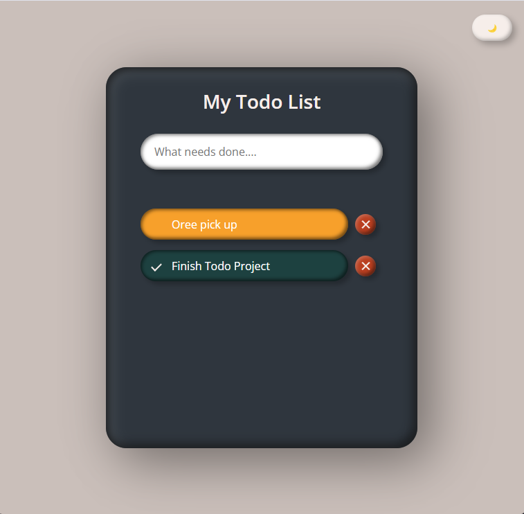

# ✨ Neumorphic To-Do List

A sleek, animated to-do list app with dark/light theme support, localStorage persistence, and mobile-friendly interactions. Built with vanilla JavaScript, HTML, and CSS — no frameworks, just vibes.

 

## 📸 Preview

Tip: Add a live demo link here (e.g., View it on GitHub Pages)

## 🌟 Features

- ✅ Add tasks via keyboard
- ❌ Swipe or click to delete
- 🎯 Mark tasks as complete
- 💾 Tasks saved in localStorage
- 🌙 Toggle between light and dark mode
- 📱 Mobile-ready with swipe gestures
- 💫 Bouncy theme toggle button animation

## 🛠️ Tech Stack

- HTML5 + CSS3
- Vanilla JavaScript
- CSS variables and transitions
- Neumorphism-inspired design

## 🚀 Future Enhancements

 - Drag-and-drop task reordering

 - Due date or reminder system

 - Task categories / tags

 - Sync across devices using Firebase or Supabase

 ## 👩‍💻 Author
 **Karen Byrd** &nbsp; &nbsp; &nbsp; 
 *[klbdev88@gmail.com](klbdev88"gmail.com)*
 ### Blue Byrd Developments
 

 

 ## 📄 License
 MIT License. Use it, remix it, make it your own. Just don’t forget to have fun with it 💥